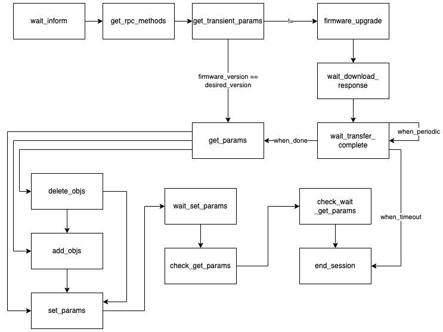

# The concept of State Machine

The state machine map was pre-defined in eNodeBD driver, and the state machine managers are responsible to maintain the current state and related information. After event triggered or condition satisfied, the state machine manager will transfer the state to next state.

The eNodeBD will initiate a state machine manager for each eNodeB when a new connection incoming, it uses source IP address or NGINX real IP header as key to build state machine manager instance.

## StateMap

In the state map, it always start from `wait-inform` state, the state map defined by `ENodeBHandler._state_map`, which can be illustrated as the following diagraph.

In the example, the state map shows the state will change by different cases, in `get_transient_params` state, ACS will get the firmware version from eNB, when the version is different from desired version, the state will change to `firmware_upgrade` state and do the upgrade, otherwise, it will move on to the `get_params` and start configuring process.

